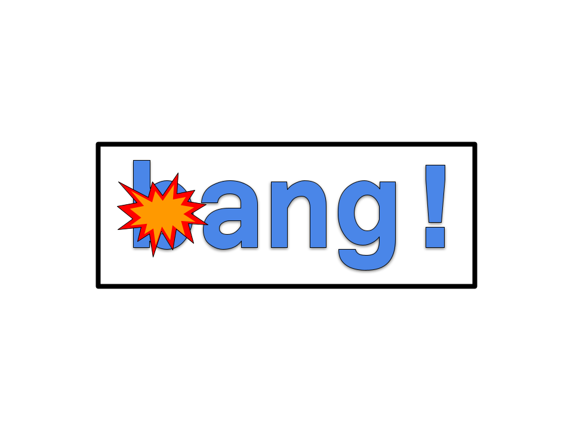

# Bang!

A compiler for the programming language "bang!"

Aidan Srjoui, Natalie Lau, and Abe Moore Odell have competed as a team in the LMU Git Gud programming competition for the past two years. After losing to the professors by 0.3 points in the last competition, the team decided to create a programming language specifically designed for the type of coding done in limited time competitions and interviews. Their creation, known as "Bang!", is a dynamically typed language that makes use of concise and clear syntax to create a pleasant and swift programming experience. By treating everything as an object, Bang! gives programmers many time-saving options, such as the ability to create loops from numbers and its signature "bang functions". The mission? Minimize typing, and maximize winning.

## Sample Code

<table>
<tr>
<th>Bang!</th>
<th>javascript</th>
</tr>
<tr>
<td>

```javascript
x = 17
greeting = "hello"
greeting = "bye"
const decayRate = 0.05
```

</td>
<td>

```javascript
let x = 17
let greeting = "hello"
greeting = "bye"
const decayRate = 0.05
```

</td>
</tr>
<tr></tr>
<tr>
<td>

```cs
firstName = "John"
lastName = "Doe"

print($"Hello, {firstName} {lastName}!")
```

</td>
<td>

```javascript
let firstName = "John"
let lastName = "Doe"

console.log(`Hello, ${firstName} ${lastName}!`)
```

</td>
</tr>
<tr></tr>
<tr>
<td>

```javascript
-2**2
// syntax error
```

</td>
<td>

```javascript
-2**2
// syntax error
```

</td>
</tr>
<tr></tr>
<tr>
<td>

```
sum = (x, y) -> { x + y }
sum = (x, y) -> x + y
```

</td>
<td>

```javascript
let sum = function (x, y) {
  return x + y
}
let sum = (x, y) => x + y
```

</td>
</tr>
<tr></tr>
<tr>
<td>

```javascript
5.loop(() -> { print("hello world") })
5.loop(() -> print("hello world"))
5.loop({ print("hello world") })
5.loop(print("hello world"))
```

</td>
<td>

```javascript
for (let _ = 0; _ < 5; _++) console.log("hello world")
```

</td>
</tr>
<tr></tr>
<tr>
<td>

```javascript
5.loop(i -> { print(i)) })
5.loop(i -> print(i))
5.loop(print)
```

</td>
<td>

```javascript
for (let i = 0; i < 5; i++) console.log(i)
```

</td>
</tr>
<tr></tr>
<tr>
<td>

```javascript
range(5).loop((i) -> { print(i) })
range(5).loop((i) -> print(i))
range(5).loop(print)
// prints 0-4 on separate lines

range(1, 6).loop(print)
// prints 1-5 on separate lines
```

</td>
<td>

```javascript
for (let i = 0; i < 5; i++) console.log(i)
[...Array(5).keys()].forEach(i => console.log(i))
// prints 0-4 on separate lines

for (let i = 1; i < 6; i++) console.log(i)
[...Array(5).keys()].map(i => i + 1).forEach(i => console.log(i))
// prints 1-5 on separate lines
```

</td>
</tr>
<tr></tr>
<tr>
<td>

```swift
isValid ? print("valid!")
```

</td>
<td>

```javascript
if (isValid) {
  console.log("valid!")
}
```

</td>
</tr>
<tr></tr>
<tr>
<td>

```swift
isValid ? print("valid!") : print("invalid!")
```

</td>
<td>

```javascript
if (isValid) {
  console.log("valid!")
} else {
  console.log("invalid!")
}
```

</td>
</tr>
<tr></tr>
<tr>
<td>

```swift
optional = isValid
  ? { object }
  : { print("invalid") }
optional = isValid ? object : print("invalid")

const objectField = optional?.fieldName
```

</td>
<td>

```javascript
let optional
if (isValid) {
  optional = object
} else {
  console.log("invalid")
}
const objectField = optional?.fieldName
```

</td>
</tr>
<tr></tr>
<tr>
<td>

```swift
const isValid = false
optional = isValid ? object : print("invalid")
// prints "invalid"

const objectField = optional?.fieldName
// objectField = nil
```

</td>
<td>

```javascript
const isValid = false
let optional
if (isValid) {
  optional = object
} else {
  console.log("invalid")
}
// prints "invalid"

const objectField = optional?.fieldName
// objectField is undefined
```

</td>
</tr>
<tr></tr>
<tr>
<td>

```swift
isValid = false
optional = isValid
  ? object
  : () -> print("invalid")
optional?() // prints "invalid"
```

</td>
<td>

```javascript
let isValid = false
let optional = isValid ? object : () => console.log("invalid")
optional() // prints "invalid"
```

</td>
</tr>
<tr></tr>
<tr>
<td>

```swift
enum Season { spring, summer, fall, winter }
print(Season.spring) 
// prints 'spring'
```

</td>
<td>

```javascript
const Season = Object.freeze({
  spring: "spring",
  summer: "summer",
  fall: "fall",
  winter: "winter",
})
```

</td>
</tr>
<tr></tr>
<tr>
<td>

```swift
enum Season {
  spring = '🌷',
  summer = '☀️',
  fall = '🍁',
  winter = '❄️'
}

print(Season.spring)
// prints "🌷"
```

</td>
<td>

```javascript
const Season = Object.freeze({
  spring: "🌷",
  summer: "☀️",
  fall: "🍁",
  winter: "❄️",
})

console.log(Season.spring)
// prints "🌷"
```

</td>
</tr>
<tr></tr>
<tr>
<td>

```swift
season = Season.fall
result = match season {
  case .spring: "spring!",
  case .summer: { "summer!" },
  case .fall, .winter: {
    str = "is cold!"
    str
  },
  default: "California!"
}
print(result)
// prints "is cold!"
```

</td>
<td>

```javascript
let season = Season.spring
let result
switch (season) {
  case "spring":
    result = "spring!"
    break
  case "summer":
    result = "summer!"
    break
  case "fall":
  case "winter":
    let str = "is cold!"
    result = str
    break
  default:
    result = "California!"
}
console.log(result)
// prints "is cold!"
```

</td>
</tr>
</table>

Natalie "nat" Lau is a third-year CS student at Loyola Marymount University interested in language scemantics and design, mobile app development, and video game development. Some of her past projects include implementing Linux kernel modules using sockets, and a mobile app companion for the game Breath of the Wild.

Abraham "Abe" Moore Odell is a computer science student at Loyola Marymount University with interests in AI, language design, and game design. Some of his past projects include AI game playing agents, and a video generator.

Aidan Srouji is a third-year CS student at LMU, interested in applying artificial intelligence agents to the field of video game development. Some of his past projects include implementing an automatic speech recognition deep learning model, and creating a text-based multiplayer game run through the Discord platform.

## Code of Conduct

Feel free to add or recommend any features or changes to the language. If you do, please do so with kindness and consideration for all other contributors, users, and people across the globe. "bang!" uses the MIT license.
